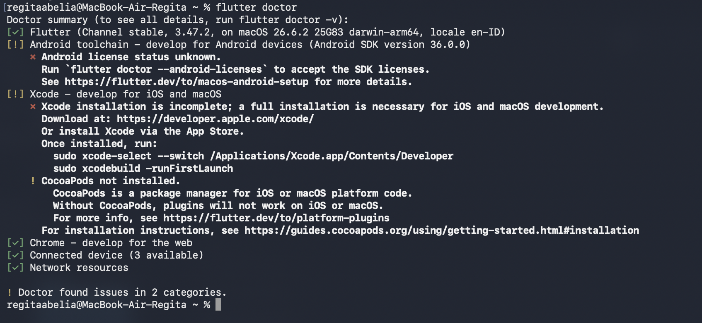
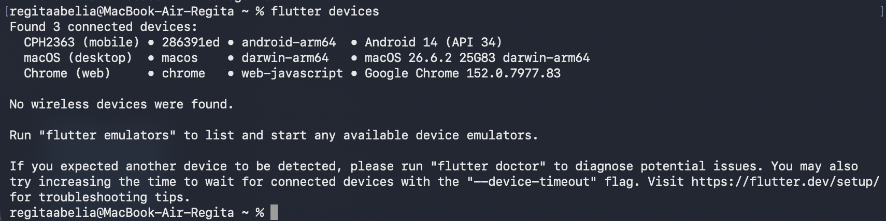
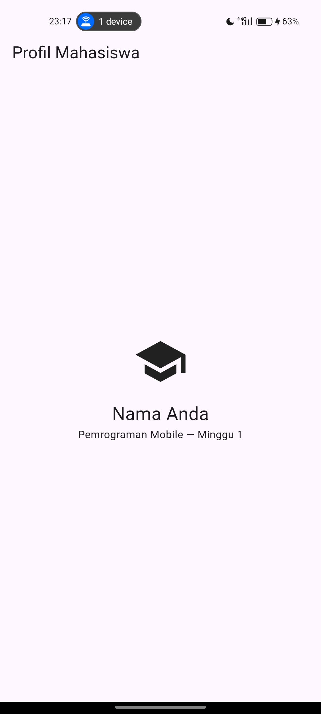
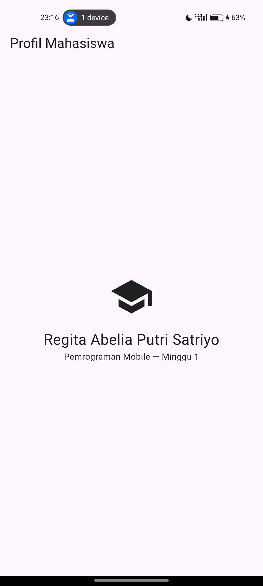
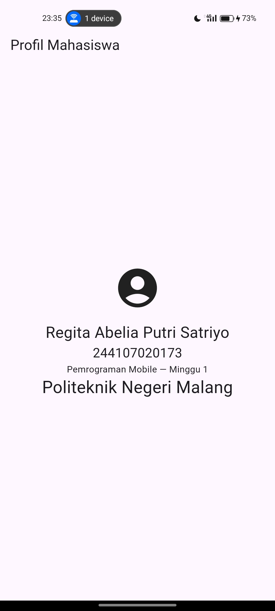

|  | Pemrograman Mobile |
|--|--|
| NIM |  244107020173|
| Nama |  Regita Abelia Putri Satriyo |
| Kelas | TI - 3C |

# WEEK 1
## Mobile Development Ecosystem & Flutter Refresh

### Tujuan 

Mempelajari pengetahuan dasar dalam membangun aplikasi mobile menggunakan Flutter dan Bahasa pemrograman Dart

### Fitur Utama

1. Tampilan Profil Mahasiswa 

    Menampilkan data diri Mahasiswa berupa Nama, NIM, Mata Kuliah, dan Perguruan Tinggi

2. Visual Profil

    Menampilkan icon pengguna sebagai pengganti foto profil

### Stack Teknologi

1. Git

    Untuk mencatat perubahan kode dan mengunggah ke GitHub

2. VS Code

    Code Editor tempat menulis kode dan Ekstensi Flutter & Dart

3. Flutter SDK

    Kumpulan software dan libraries yang dikembangkan Google untuk membuat aplikasi cross-platform

4. Android Studio & Android SDK

    - Android Studio merupakan tempat untuk para developer untuk menulis, merancang, menguji, dan melakukan debugging kodingan aplikasi Android. 
    -  Android SDK mengompilasi kode menjadi aplikasi Android serta mmenghubungkan aplikasi tersebut dengan fitur hardware perangkat.

### Hasil 

Berikut bukti visual dan dokumentasi:

- Tampilan flutter doctor

- Tampilan flutter devices

- Tampilan awal:

- Tampilan setelah nama diubah:

## Mini Assignment

Menambahkan NIM dan satu informasi tambahan (Perguruan Tinggi)

- Tampilan percobaan pada Mini Assignment:

## Refleksi

1. Kapan native lebih tepat dipilih daripada cross-platform?
    - native lebih tepat dipilih ketika butuh fitur khusus seperti Bluetooth, AR atau pemrosesan kamera/audio.

2. Bagaimana perubahan state berhubungan dengan widget tree dan UI deklaratif?
    - ketika data (state) berubah, sistem otomatis mencetak foto baru (menggambar ulang Widget Tree) yang sesuai.
    
3. Mengapa commit kecil dengan pesan jelas bermanfaat bagi pekerjaan tim dan portfolio?
    - kode akan lebih mudah diperiksa oleh anggota tim lain dan meminimalisir terjadinya konflik sedangkan dalam portofolio akan menunjukkan bahwa kita bekerja dengan rapi dan terlihat lebih profesinal.