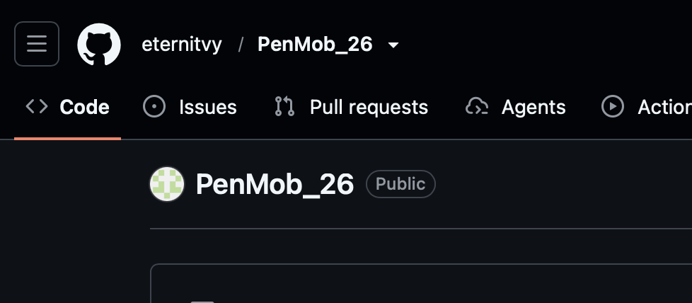
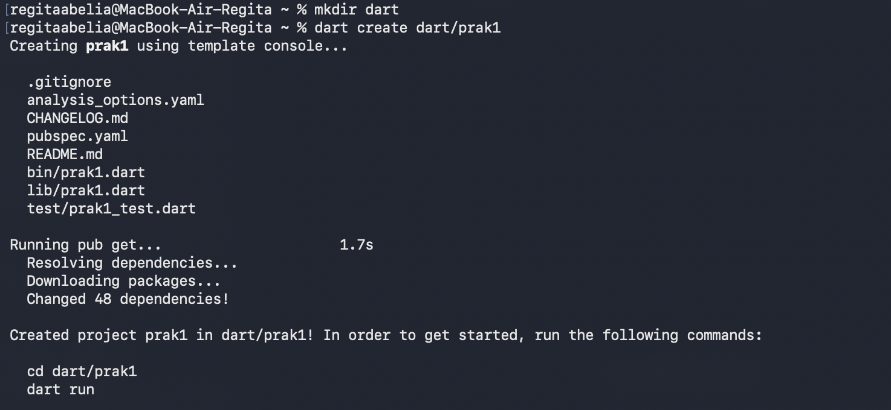

|  | Pemrograman Mobile |
|--|--|
| NIM |  244107020173|
| Nama |  Regita Abelia Putri Satriyo |
| Kelas | TI - 3C |
  

# Minggu 1 - Mobile Development Ecosystem & Flutter Refresh

### Langkah-langkah

1. Membuat Repository untuk mata kuliah Pemrograman Mobile

2. Melakukan installasi Dart SDK

3. Membuat file prak1 di folder dart

