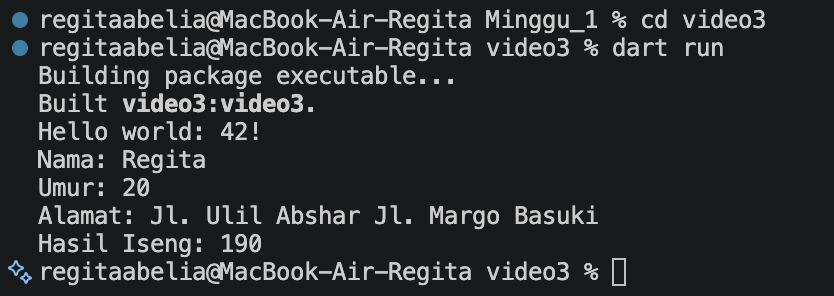
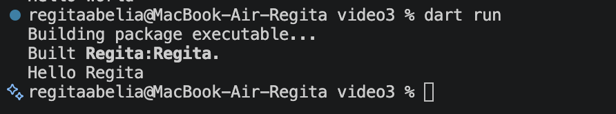

|  | Pemrograman Mobile |
|--|--|
| NIM |  244107020173|
| Nama |  Regita Abelia Putri Satriyo |
| Kelas | TI - 3C |
  

# Minggu 1 - Mobile Development Ecosystem & Flutter Refresh

### Langkah-langkah

1. Memodifikasi kode program pada file [video3.dart](bin/video3.dart)

2. Membuat file dart baru [Regita.dart](bin/Regita.dart) dan memodifikasi kode program pada file [pubspec.yaml](pubspec.yaml)

